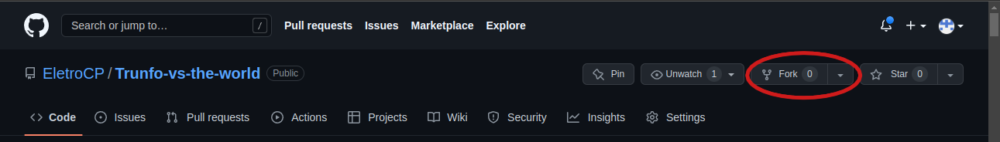
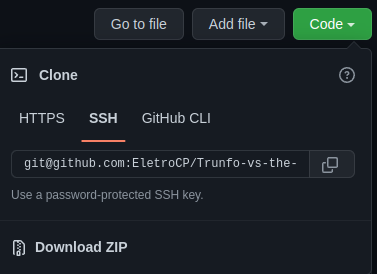

# Bem vindo ao repositório do projeto Trunfo Vs the World

Aqui você encontrará detalhes de como utilizar o projeto, clona-lo, minhas motivações para com ele entre outras coisas.

## Agradecimento

Obrigado [@Yuut-Reis](https://github.com/Yuut-Reis) por me ajudar a com o layout do projeto.

# Habilidades

Neste projeto essas são algumas das coisas que pretende desenvolver:

  * Ler o estado de um componente e usá-lo para alterar o que exibimos no browser

  * Inicializar um componente, dando a ele um estado pré-definido

  * Atualizar o estado de um componente

  * Capturar eventos utilizando a sintaxe do React

  * Criar formulários utilizando sintaxe JSX com as tags: `input`, `textarea`, `select`, `form`, `checkbox`

# Rodando localmente

1° Crie um <i>'fork'</i> e entõo crie um repositório proprio para aditar o projeto.
  * 

2° Com a 'copia' do projeto clone o repositorio localmente.
  * 

3° Acesse a pasta onde o projeto foi clonado, abra o terminal na mesma e rode o comando 'npm install'
  * Certifique-se de ter um gerenciador de pacotes.

4° Após as dependencias serem intaladas ainda no terminal rode o comando 'npm start'.

5° Divirta-se.

## Code Review

Caso tenha encontrado algum erro, ou tem alguma solução alternativa para o que foi feito, sinta-se a contade para deixar um code review, feedbacks são sempre importantes.

# Informações sobre o Super Trunfo

O Super Trunfo é um jogo de cartas que ficou muito popular no Brasil entre as décadas de 80 e 90, mas que faz bastante sucesso até hoje. Suas regras são bastante simples, por isso ele é considerado um jogo fácil de jogar. Apesar de ter regras simples, cada baralho  de Super Trunfo pode ter um tema diferente, o que o torna um jogo bastante divertido.

Originalmente, o jogo de Super Trunfo é formado por um baralho de 32 cartas. Cada carta representa um item relacionado ao tema do jogo. Em cada carta também existe uma lista com características daquele item e cada característica possui um valor numérico. 

Para começar o jogo, as cartas devem ser embaralhadas e divididas igualmente para cada participante. Em cada rodada cada pessoa pega somente a primeira carta do seu monte. Na primeira rodada uma pessoa escolhe qual característica quer comparar com as cartas das outras pessoas que estão jogando. Ganha quem tiver o maior número nessa característica. A pessoa que ganhou a rodada recebe as cartas das outras pessoas e escolhe qual característica quer comparar na próxima rodada. O jogo termina quando alguma pessoa tiver todas as cartas do baralho.

Em cada baralho existe uma (e somente uma) carta Super Trunfo. Essa carta ganha de todas as outras cartas do baralho, independentemente dos valores das características.

O jogo de Super Trunfo pode ser feito com praticamente qualquer tema, mas tradicionalmente os mais comuns são: carros, países, cidades ou animais.